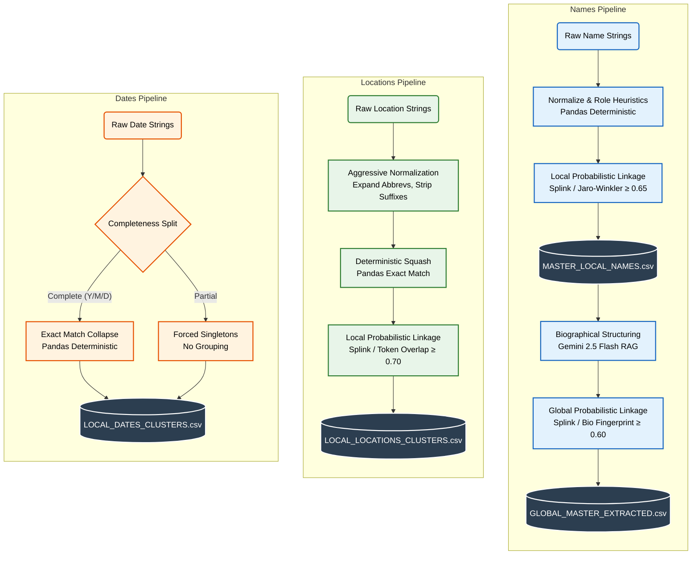
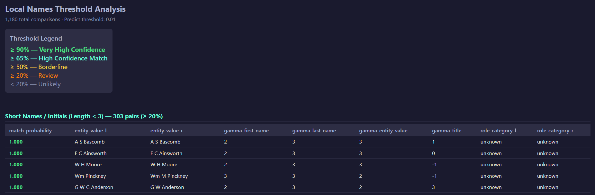
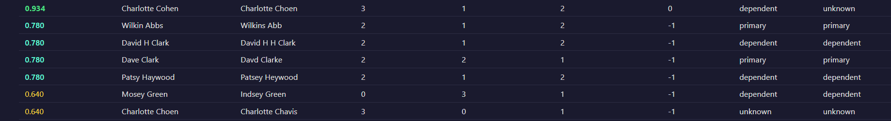
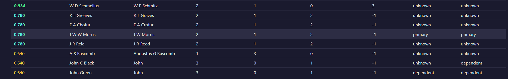
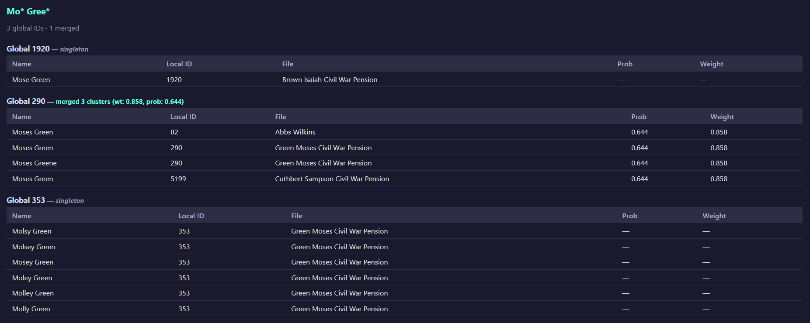

# Entity Resolution & Narrative Pipeline

## Table of Contents
- [Vision](#vision)
- [Core Research Questions Answered](#core-research-questions-answered)
  - [1. Which person records within a single file refer to the same individual? (Local Grouping)](#1-which-person-records-within-a-single-file-refer-to-the-same-individual-local-grouping)
  - [2. Which person records across different files refer to the same individual? (Global Grouping)](#2-which-person-records-across-different-files-refer-to-the-same-individual-global-grouping)
  - [3. Can you identify recurring secondary figures (agents, clerks, doctors)?](#3-can-you-identify-recurring-secondary-figures-agents-clerks-doctors)
  - [4. What approach works best for this problem at scale?](#4-what-approach-works-best-for-this-problem-at-scale)
- [Entity Typology & Database Fields](#entity-typology--database-fields)
  - [1. Names](#1-names)
  - [2. Locations](#2-locations)
  - [3. Dates](#3-dates)
- [Architecture & Domain Structure](#architecture--domain-structure)
  - [High-Level Pipeline Flow](#high-level-pipeline-flow)
  - [Data Storage Structure](#data-storage-structure)
  - [CSV Output Schemas](#csv-output-schemas)
- [Names](#names)
  - [Phase 1: Local Name Resolution (01_grouping_local.py, test_local.py)](#phase-1-local-name-resolution-01_grouping_localpy-test_localpy)
  - [Phase 2: RAG-Driven AI Structuring (02_extraction.py)](#phase-2-rag-driven-ai-structuring-02_extractionpy)
  - [Phase 3: Probabilistic Global Linkage (03_grouping_global.py, test_global.py)](#phase-3-probabilistic-global-linkage-03_grouping_globalpy-test_globalpy)
- [Locations](#locations)
  - [Local Locations Resolution (01_grouping_local.py, test_local.py)](#local-locations-resolution-01_grouping_localpy-test_localpy)
- [Dates](#dates)
  - [Local Dates Resolution (01_grouping_local.py, test_local.py)](#local-dates-resolution-01_grouping_localpy-test_localpy)
- [Execution Guide](#execution-guide)
  - [End-to-End Pipeline](#end-to-end-pipeline)
  - [Running Individual Modules](#running-individual-modules)
  - [Running Validation Audits](#running-validation-audits)
- [Future Work & Next Steps](#future-work--next-steps)
  - [1. Narrative Generation (LLM Synthesis)](#1-narrative-generation-llm-synthesis)
  - [2. Zooniverse Integration & Human-in-the-Loop Validation](#2-zooniverse-integration-human-in-the-loop-validation)
  - [3. Visualization of Relationships & Events](#3-visualization-of-relationships-events)
  - [4. Comprehensive AI Extraction](#4-comprehensive-ai-extraction)


## Vision
The ultimate goal of this pipeline is to transform thousands of pages of unstructured, messy historical cursive text from United States Colored Troops (USCT) pension files into structured, chronological, human-readable narratives.

Even with AI transcription, the data remains highly inconsistent: names may appear with multiple spellings, enlistment dates may conflict, and locations are often misspelled or historically outdated. This pipeline addresses these challenges through a hybrid data engineering approach that combines:
*    Deterministic grouping
*    Bayesian probabilistic matching (Splink/DuckDB)
*    Semantic AI extraction (Gemini RAG)

By linking fragmented entities, particularly names, dates, and locations, across numerous pages/documents, the pipeline converts raw text into a validated and consolidated dataset. This structured foundation enables the downstream generation of cohesive biographical narratives. These scripts also document how different entity types are handled, highlight the limitations of grouping, and establish a scalable framework for future improvements in entity resolution.

## Core Research Questions Answered
This pipeline is specifically engineered to answer four critical questions:

### 1. Which person records within a single file refer to the same individual? (Local Grouping)
Before looking across the entire archive, we must resolve identities locally. The pipeline aggressively standardizes names, squashes perfect matches using Pandas, and aggregates all fragmented sentences surrounding that name into a single "context string." A custom heuristic then scans this text for keywords (e.g., "soldier," "widow," "orphan") to categorize the entity's role.

### 2. Which person records across different files refer to the same individual? (Global Grouping)
This is the hardest challenge. Two files might mention a "Jacob Jones," but are they the same person? The pipeline uses a strict Same-File Firewall (mathematically vetoing merges within the same PDF) and relies on AI-Enriched Biographical Fingerprints (comparing LLM-extracted birth years, slaveholder names, and family members) to calculate the posterior probability of a global match.

### 3. Can you identify recurring secondary figures (agents, clerks, doctors)?
Yes. Because the global linkage engine runs on all extracted names—not just primary soldiers—it inherently clusters secondary figures. A doctor who performed medical examinations for 50 different soldiers will surface in the final `GLOBAL_MASTER_EXTRACTED.csv` with a `Linked_Files_Count` of 50. Sorting by this column immediately reveals the systemic actors within the pension bureaucracy.

### 4. What approach works best for this problem at scale?
No single approach works for historical data.

*   **Rule-Based (Pandas):** Best for the initial pass. Extremely fast for squashing 100% exact matches and shrinking the dataset by 50% instantly.
*   **Fuzzy/Probabilistic (Splink):** Best for structural typos and spelling variations (e.g., "Beaufort" vs "Beaufort County").
*   **LLM/Embeddings (Gemini + Weaviate):** Best for semantic extraction. We use RAG to retrieve relevant chunks and strict, zero-temperature prompting to extract structured JSON (birth, marriage, slaveholder) to fuel the final probabilistic linkage.

## Entity Typology & Database Fields
The pipeline processes three distinct classes of historical entities extracted from the `transcriber_db.db` SQLite database. Because Names, Locations, and Dates behave fundamentally differently within a relational data model, each class demands a bespoke resolution strategy.

### 1. Names
*   **Scope:** Local & Global Linkage
*   **Schema Anchors:** `first_name`, `last_name`, `middle_name`, `middle_initial`, `title`, `context` (Table: `persons`)
*   **Resolution Strategy:** Names represent continuous human entities. They are first deduplicated **Locally** (within a single document) to collapse OCR noise, initials, and spelling variations into a canonical profile. These profiles are then linked **Globally** (across the entire archive) using AI-extracted biographical fingerprints, allowing the pipeline to track soldiers, witnesses, and bureaucratic agents as they navigate the pension system.

### 2. Locations
*   **Scope:** Local Linkage Only
*   **Schema Anchors:** `place_name`, `type`, `city`, `county`, `state`, `country`, `context` (Table: `locations`)
*   **Resolution Strategy:** Locations provide the geographic stage for the narrative. They are grouped **Locally** to consolidate fragmented or abbreviated geographic mentions (e.g., mathematically merging "Beaufort" with "Beaufort County") into unified spatial nodes for a single soldier's timeline.
*   **Why No Global Linkage?:** While "Washington D.C." is the same physical place across 500 different files, linking those files based solely on shared geography creates massive, meaningless graph clusters. Geographic overlap does not imply a historical relationship, so spatial data is deliberately isolated to the local narrative.

### 3. Dates
*   **Scope:** Local Linkage Only
*   **Schema Anchors:** `year`, `month`, `day`, `date_type`, `context` (Table: `dates`)
*   **Resolution Strategy:** Unlike Names and Locations, Dates are not entities—they are isolated chronological events. They are grouped **Locally** using strict, deterministic (non-probabilistic) rules to collapse identical bureaucratic repetitions and clean up the timeline.
*   **Why No Global Linkage?:** If the engine globally merged "December 5, 1864", it would erroneously link Soldier A's heroic battlefield enlistment with Soldier B's fatal hospital admission simply because they occurred on the same Tuesday. Global date grouping provides zero relational value and actively destroys narrative isolation. A historical date only has meaning within the specific human context to which it is attached.

## Architecture & Domain Structure

### High-Level Pipeline Flow


### Data Storage Structure
```text
grouping_scripts/
├── dates/   
│   ├── 01_grouping_local.py
│   ├── dates_utils.py
│   └── test_local.py
├── locations/ 
│   ├── 01_grouping_local.py
│   ├── locations_utils.py
│   └── test_local.py
├── names/
│   ├── 01_grouping_local.py
│   ├── 02_extraction.py
│   ├── 03_grouping_global.py
│   ├── names_utils.py
│   ├── test_local.py
│   └── test_global.py
├── output/
├── utils/
│   ├── clean_utils.py
│   └── db_utils.py
└── run_pipeline.py
```

*   **`names/`**: Scripts for matching and clustering human names. Features contextual role-tagging (Primary vs Dependent) and aggressive Jaro-Winkler typological matching.
*   **`locations/`**: Scripts for deduplicating geographical places. Features historical abbreviation expansion, rigorous geo-suffix stripping (e.g., removing "county" or "city"), and multi-token overlap algorithms.
*   **`dates/`**: Scripts for collapsing historical dates. Features strict contradiction vetoes and segregates incomplete/partial dates to prevent erroneous groupings.
*   **`utils/`**: Shared, generic utilities for database interactions (`db_utils.py`) and string cleaning/merging (`clean_utils.py`).
*   **`output/`**: The destination folder where all final CSV master lists and HTML data visualizations are exported.

### CSV Output Schemas

Below is a quick reference table of the final CSV files generated by the pipeline and the columns they contain:

| File Name | Output Scope | Columns Included |
| :--- | :--- | :--- |
| `MASTER_LOCAL_NAMES.csv` | Names (Local) | `cluster_id`, `canonical_name`, `alt_name`, `pdf_file`, `gemini_extracted`, `birth_age`, `slaveholder_info`, `marriage_info`, `family_members` |
| `GLOBAL_MASTER_EXTRACTED.csv` | Names (Global) | `Global_ID`, `Primary_Name`, `Aliases`, `Linked_Files_Count`, `Source_Files`, `Total_Rows_Merged`, `AI_Extracted`, `Birth_Age`, `Slaveholder_Info`, `Marriage_Info`, `Family_Members` |
| `LOCAL_LOCATIONS_CLUSTERS.csv` | Locations (Local) | `pdf_file`, `cluster_id`, `place_name`, `type`, `city`, `county`, `state`, `country`, `page`, `context` |
| `LOCAL_DATES_CLUSTERS.csv` | Dates (Local) | `pdf_file`, `cluster_id`, `month`, `day`, `year`, `date_type`, `page`, `context` |

## Names 
### Phase 1: Local Name Resolution (01_grouping_local.py, test_local.py)

#### Overview
The `01_grouping_local.py` script performs local entity resolution to determine which name variations within a single historical document (PDF) refer to the exact same person.

#### The Architecture & Execution Flow

**1. Normalization (names_utils.py)**
Before grouping, raw data from the Persons table is pulled and builds the `entity_value`, which is a sanitized, concatenated "Full Name" string.
*   **Middle Name Resolution:** It evaluates `middle_name` and `middle_initial`. If a full middle name exists, it uses it; otherwise, it falls back to the initial, creating an `effective_middle`.
*   **Punctuation & Whitespace Stripping:** It aggressively strips periods (turning "Wm." into "Wm") and squashes double/triple spaces.
*   **The Entity Value:** The resulting `entity_value` (e.g., "William H Smith") is forced into Title Case and serves as the clean mathematical baseline for the rest of the pipeline.

**2. Deterministic Collapse**
The script groups the dataset by `['file_id', 'entity_value', 'first_name', 'last_name']`.
It squashes all perfectly normalized matches down to a single row.
*   **Context Aggregation:** During this collapse, it concatenates every isolated snippet of title and context text into a single, continuous, lowercased string, preserving every historical mention.

**3. Role Heuristic Scoring**
With the fragmented sentence contexts safely merged, the script applies the `determine_role` heuristic. It scans the newly combined text for contextual keywords (e.g., "soldier," "widow," "orphan," "attorney"). It tallies primary vs. dependent keywords to tag each unique entity as primary, dependent, or unknown.

**4. Bayesian Probabilistic Linkage (Splink + DuckDB)**
The compressed dataset is passed into a Splink Linker to evaluate the fuzzy relationships between the remaining distinct profiles. The engine calculates the posterior probability that two different profiles represent the same person. It evaluates four specific fields: `entity_value`, `title`, `first_name`, and `last_name`, scoring them against a baseline random match probability (u-probability) of 10% (a high baseline reflecting the fact that the entities already share a single file).

**5. Cluster Export & DB Sync**
The script updates the SQLite database with the new `cluster_ids`, collapses the identities into canonical representations, and exports `MASTER_LOCAL_NAMES.csv` to feed the Phase 2 AI extraction.

#### The Validation Framework (test_local.py)
*   **Targeted Extraction:** The script filters the SQLite database to isolate a small subset of pension files (e.g., files containing "Jones," "Brown," "Green").
*   **Low-Threshold Inference:** It runs the Splink prediction engine at a low threshold (0.01). Instead of just finding matches, this forces the engine to output the exact mathematical score of almost every pairwise comparison.
*   **Visual Audit Trail:** It exports `test_local_predictions.html`, a stylized, color-coded HTML report. This report automatically categorizes matches into "Short Names / Initials" vs. "Full Names," allowing for visual inspection of the gamma levels and mathematically tracing exactly why "Jacob Jones" and "Jacb Jones" scored an 88%, while "William Jones" and "John Jones" were safely vetoed.



**Full Names Linkage Example:**


**Short Names & Initials Linkage Example:**


#### The Engineering Decisions (The "Why")

**Decision 1: Building the entity_value Upfront**
Punctuation destroys probabilistic algorithms. "W.H. Smith" and "WH Smith" score surprisingly low if periods aren't handled. By aggressively creating a sanitized `entity_value` upfront, we allow Pandas to group thousands of identical entities instantly with zero compute cost, reserving the heavy probabilistic math only for actual spelling variations.

**Decision 2: Why Jaro-Winkler?**
Levenshtein simply counts raw character edits, treating a typo at the beginning of a word the same as a typo at the end. Jaro-Winkler, however, applies a heavy mathematical premium to strings that share the exact same prefix. This makes it highly effective for name matching and historical OCR, where the first few letters of a name are almost always transcribed correctly (e.g., correctly rewarding "William" vs. "Willaim", while safely separating "William" from "Gilliam").

**Decision 3: The Structural Firewalls**
*   **The Same-File Gate:** `l.file_id = r.file_id` ensures the engine only looks within a single document, as requested.
*   **The Role Clash Veto:** `NOT (l.role_category = 'primary' AND r.role_category = 'dependent')`. This mathematically guarantees that a primary soldier and his dependent (who often share the exact same last name, e.g., a father and son) are never accidentally merged.
*   **The First Name Hard-Stop:** `jaro_winkler_similarity(l.first_name, r.first_name) < 0.65`. This prevents the engine from merging "William Smith" and "John Smith" just because they are in the same file.

**Decision 4: Asymmetrical Feature Weighting**
Instead of applying a blanket fuzzy-match threshold, the name columns are weighted differently:
*   **Last Names are Strict:** The Jaro-Winkler thresholds for `last_name` are set extremely high (0.95 and 0.85). Last names are the anchor of historical identity.
*   **First Names are Forgiving:** The thresholds for `first_name` are lowered (0.85 and 0.75). This accounts for the common use of historical nicknames and abbreviations (e.g., "Wm" vs "William").

**Decision 5: How the 65% Threshold Was Determined**
Both the `PREDICT_THRESHOLD` and `CLUSTER_THRESHOLD` are currently set at 0.65. This number was empirically derived using the `test_local.py` harness. By examining the HTML output of raw comparisons, a distinct drop-off was observed: true positive historical typos consistently scored above 0.70, while false positives (distinct people with similar names) struggled to break 0.5. Setting the threshold at a strict 0.65 reflects a deliberate choice: it is vastly preferable to "under-merge" (leaving a single person as two separate profiles) than to "over-merge" (accidentally combining two distinct individuals into a single corrupted timeline).

---

### Phase 2: RAG-Driven AI Structuring (02_extraction.py)

#### Overview
Phase 2 bridges the gap between raw entity resolution and biographical analysis. The `02_extraction.py` script analyzes the unstructured OCR text, utilizes a Retrieval-Augmented Generation (RAG) architecture powered by Weaviate and Google's `gemini-2.5-flash` to extract four critical biographical data points: Birth Age, Slaveholder Information, Marriage Information, and Family Members.

#### The Architecture & Execution Flow

**1. State Management & Batch Control**
The script queries the SQLite database via `build_master_list` to pull all canonical local profiles, explicitly filtering for profiles where `gemini_extracted` is not yet flagged as `1`. It limits execution to batches to manage API throughput and costs, ensuring the pipeline can be paused and resumed without reprocessing data.

**2. Semantic Retrieval (Weaviate Vector DB)**
Instead of feeding entire historical PDFs to the LLM, the script dynamically retrieves only the top most relevant passages.
*   It generates a query vector using `gemini-embedding-2-preview` for the target concept: "{name} biography birth slaveholder marriage family".
*   **The Filter:** It executes a semantic vector search in Weaviate, strictly filtering the results by the `pdf_file` property to ensure it only retrieves chunks from the correct historical document.

**3. Generative Extraction (Strict JSON Formatting)**
The retrieved historical chunks (truncated to optimize the context window) are passed to `gemini-2.5-flash`.
*   The model is constrained by a highly specific, zero-temperature prompt. It is instructed to extract the four target fields and return them strictly as a validated JSON object. If information is missing from the text, the model is forced to output `null`.

**4. Concurrency & Database Sync**
*   The script utilizes a `ThreadPoolExecutor` with concurrent workers to dramatically speed up the network-bound API calls. As each thread successfully extracts a biography, it instantly commits the JSON fields to the SQLite `persons` table and flags the row as `gemini_extracted = '1'`.

#### The Engineering Decisions

**Decision 1: RAG vs. Full-Context Prompting**
Historical pension files are often hundreds of pages long and full of dense, repetitive OCR text. Pumping an entire file into an LLM context window is not only prohibitively expensive but also increases the likelihood of "attention decay," where the model loses track of the target entity in the middle of the document. By using Weaviate to retrieve only the top mathematically relevant text chunks, we isolate the highest-density biographical information, drastically reducing cost, latency, and hallucinations.

**Decision 2: Temperature 0.1 & The JSON Schema**
We are using a generative AI model to perform strict data entry.
*   **Temperature 0.1:** This eliminates the model's "creativity." We do not want the AI guessing a soldier's birth year based on surrounding battles; we only want what is explicitly written in the text.
*   **Application/JSON Enforcement:** By forcing the model's output mime-type to JSON, we ensure the pipeline never breaks due to conversational filler. The output seamlessly parses into a Python dictionary for immediate database insertion.

**Decision 3: The Negative Constraint**
The prompt includes a critical guardrail: *"CRITICAL: Ignore the primary soldiers if '{name}' is a secondary witness or enslaver."*
In pension files, witnesses frequently testify about the primary soldier's life. Without this strict negative constraint, generative models tend to "bleed" the soldier's rich biography into the witness's empty JSON fields. This instruction forces the model to maintain strict entity isolation.

**Decision 4: Resilient Network Engineering**
When iterating over thousands of database rows and making concurrent calls to the Gemini API, 429 (Rate Limit) and 503 (Service Unavailable) errors are inevitable. Rather than letting a single dropped request crash the entire batch, the script implements a custom `get_embedding_with_retry` and generation fallback. It uses an exponential backoff loop, ensuring the pipeline is robust enough to run unattended for hours at scale.

**Decision 5: Model Selection (Gemini Flash & Embeddings)**
The pipeline leverages `gemini-embedding-2-preview` and `gemini-2.5-flash`.
*   **Embeddings:** The `gemini-embedding-2-preview` is a modern, low-cost embedding model that easily maps modern search queries to archaic 19th-century OCR text without the premium price tag.
*   **Generation:** `gemini-2.5-flash` was chosen specifically because it is incredibly fast and cheap. As a newer, lightweight model, it punches way above its weight class—handling strict JSON extraction and multithreading at a fraction of the cost and latency of heavier models (like GPT-4 or Gemini Pro).

---

### Phase 3: Probabilistic Global Linkage (03_grouping_global.py, test_global.py)

#### Overview
Phase 3 is the culmination of the entity resolution pipeline. While Phase 1 grouped names within a single file, and Phase 2 enriched those profiles with biographical data, `03_grouping_global.py` tackles the hardest historical challenge: determining which localized profiles across different files represent the exact same human being. This phase relies heavily on the "Biographical Fingerprint" generated by the LLM in Phase 2. Using Splink and DuckDB, the engine evaluates cross-file entities, mathematically weighing their names against their extracted birth years, slaveholder relationships, and family members to forge high-confidence global identities.

#### The Architecture & Execution Flow

**1. Bayesian Global Linkage (Splink + DuckDB)**
The profiles are passed into a new Linker instance, configured with a highly specialized ruleset designed for cross-file linkage.
*   The engine executes pairwise comparisons using DuckDB. It is anchored by a baseline random match probability (u-probability) of 1% (0.01), reflecting the reality that two random names pulled from the entire USCT archive are highly unlikely to be the same person.

**2. The Prediction & Clustering Split**
Phase 3 splits the prediction and clustering thresholds to generate an audit trail.
*   The `PREDICT_THRESHOLD` is set to 0.0, forcing the engine to output the raw mathematical score and individual column weights (gamma values) for every pair that passes the blocking rules. These scores are saved to `linkage_scores_audit.csv`.
*   The `CLUSTER_THRESHOLD` is set to a strict 0.60. Only pairs crossing this high-confidence barrier are assigned a shared `global_cluster_id`.

**3. Metrics & Export**
*   The script writes the new global IDs back to the database. It then calculates and prints specific compression metrics (e.g., "Merged X profiles into Y clusters"), strictly filtering these metrics to profiles that were successfully enriched by the LLM in Phase 2.
*   Finally, it calls `generate_global_master_csv` to aggregate the global entities, concatenate conflicting bio evidence (e.g., 1842 | 1845), and output the final, researcher-ready `GLOBAL_MASTER_EXTRACTED.csv`.

#### The Validation Framework (test_global.py)
Global linkage across an entire archive is incredibly prone to false positives. To ensure the mathematical models are behaving historically, the pipeline includes `test_global.py`.
*   **Targeted Auditing:** The test script isolates specific historical patterns, querying the database for known cross-file actors—like high-frequency clerks/attorneys (e.g., "Jas Crofut", "Nathan Bickford") and soldiers with extracted bios (e.g., "Wilkins Abbs", "Cain Brown").
*   **Score Mapping:** It joins the SQL database results against the `linkage_scores_audit.csv` generated during Phase 3, extracting the maximum `match_probability` and `match_weight` for each profile.
*   **Visual Output:** It generates `test_global_audit.html`, organizing the global clusters. It explicitly flags "Singletons" (profiles that failed to merge) versus "Merged" clusters, color-coding their probabilistic weights. This allows the data engineer to visually verify that the Splink engine correctly fused a clerk appearing in 16 different files into a single global entity.



#### The Engineering Decisions

**Decision 1: The "Same-File" Firewall**
In the Splink comparisons, there is a `file_clash` rule: If two profiles share the exact same `pdf_file`, they are hit with a massive mathematical penalty (m_probability: 0.01).
*   **The Why:** Phase 1 already aggressively grouped identical names within the same file. Therefore, if two distinct profiles exist in the same file at Phase 3 (e.g., two men named "William" who weren't merged locally), they are almost certainly two distinct historical actors (e.g., a father and son). This firewall mathematically overrides the engine's desire to merge them based on name similarity alone, preserving Phase 1's local distinction.

**Decision 2: Alternate Name Cross-Matching**
Historical names are fluid. A soldier might be recorded by his `canonical_name` in one file, but by an `alt_name` (alias) in another.
*   **The Why:** The `name_match` comparison explicitly checks `canonical_name_l = alt_name_r`. While an exact canonical-to-canonical match provides a massive boost (0.85), an alternate name match still provides a solid probabilistic push (0.10), bridging the gap between formal records and informal testimonies.

**Decision 3: Bridging LLM Variance with Custom Bio Boosters**
The AI-extracted fields (`slaveholder_info`, `family_members`, etc.) are not compared using exact string matches. They use a custom `long_text_comparison` (which underlyingly relies on a token-overlap Jaccard calculation).
*   **The Why:** Generative LLMs do not output identical phrasing. File A's LLM extraction might read "Born 1840 in Virginia", while File B's reads "1840, VA". An exact string match would fail. By measuring semantic token overlap, the engine provides a heavy probabilistic boost to these files, mathematically proving they describe the same life events despite phrasing differences.

**Decision 4: The AI-Extraction Output Filter**
The final `generate_global_master_csv` function executes a crucial filter: `global_df[global_df['AI_Extracted'] == 'Yes']`.
*   **The Why:** The global engine clusters everything, including passing mentions of random witnesses or clerks that were never sent to Gemini for biographical extraction. By strictly filtering the final output CSV to only include identities flagged as AI-extracted, we ensure the historians are presented with a clean, highly curated dataset of fully structured biographical profiles, hiding the un-enriched bureaucratic noise.

## Locations
### Local Locations Resolution (01_grouping_local.py, test_local.py)

#### Overview
The Locations Engine is designed to resolve these messy, fragmented geographic mentions within a single pension file into unified, canonical location clusters. It bypasses the limitations of standard fuzzy matching by employing a custom DuckDB SQL comparison architecture that uses substring absorption, token overlap, and mathematically neutral metadata fields to forge highly confident links.

#### The Architecture & Execution Flow

**1. Aggressive Linguistic Normalization (locations_utils.py)**
Before the engine evaluates a single pair, the raw text passes through a strict cleaning pipeline to generate a pristine `place_key`.
*   **Punctuation Flattening:** It explicitly converts periods, commas, and hyphens into spaces before stripping remaining non-alphanumeric characters. This guarantees that "St. Helena" safely becomes "st helena", rather than being mashed into "sthelena".
*   **Single-Letter Collapse & Expansion:** It collapses floating letters ("S C" becomes "sc") so that a massive regex dictionary (`HISTORICAL_ABBREVS`) can safely expand them into their full historical meaning ("sc" -> "south carolina").
*   **Suffix Stripping:** Bureaucratic metadata terms like "county", "township", and "parish" are stripped from the core `place_key` to normalize the baseline string.

**2. Deterministic Collapse (Pandas)**
*   The script identifies all auto-singletons (explicitly blank rows or `--`) and bypasses them. It then groups the remaining valid rows by `['pdf_file', 'place_key']`. Perfect textual matches are squashed instantly into a single row, and their surrounding context sentences are intelligently merged using `clean_and_merge_context` to eliminate redundant sentence bloat.

**3. Bayesian Probabilistic Linkage (Splink + DuckDB)**
The compressed dataset enters a customized Splink linkage model.
*   The engine executes pairwise comparisons. Because geographic names vary wildly in length, the primary `place_match` comparison utilizes a multi-tiered SQL approach: checking for exact matches, then substring containment, then token intersection, and finally Jaro-Winkler character similarity.

**4. Cluster Export & DB Sync**
*   Pairs that cross the 0.70 `PREDICT_THRESHOLD` are clustered. The script merges the newly assigned `cluster_ids` back against the raw data, applies them to the SQLite database, and exports `LOCAL_LOCATIONS_CLUSTERS.csv`.

#### The Validation Framework (test_local.py)
Geographic linkage is notoriously susceptible to the "Jaro-Winkler Trap," where adding a single word like "Island" to a short word like "James" drastically alters the mathematical score. To properly tune the engine, the pipeline relies on `test_local.py`.
*   **Ultra-Low Threshold Execution:** The test script runs the exact same Splink settings but sets the prediction threshold to 0.01.
*   **Visual Audit Trail:** It generates `test_local_predictions.html`, a stylized, color-coded HTML report showing all comparisons above 0.10. By visually mapping the scores into tiers ("Very High Confidence", "Borderline", "Unlikely"), a data engineer can explicitly see how a token-overlap rule interacts with clashing metadata, allowing for precise calibration of the final 0.70 deployment threshold.

#### The Engineering Decisions

**Decision 1: Beating the "Jaro-Winkler Trap" via Substring & Token Overlap**
Standard Jaro-Winkler similarity calculates character edits. If you compare "Washington" to "Washington, D.C.", the added abbreviation acts as a massive structural change, dropping the JW score down to roughly 0.85—often causing the engine to reject a valid match.
*   **The Solution:** The `place_match` tier explicitly implements DuckDB's `contains()` and `list_intersect()` functions. If "Washington" is mathematically contained entirely inside "Washington D C", or if they share 66% of their word tokens, the engine bypasses Jaro-Winkler entirely and applies a massive pre-calculated probabilistic boost (0.95).

**Decision 2: Mathematically Neutral Metadata**
In early iterations, if the AI extracted "St. Helena" with type `other` and "St. Helena Island" with type `island`, the engine penalized the mismatch, dragging the overall score below the threshold.
*   **The Solution:** The secondary metadata fields (`city`, `county`, `state`, `country`, `type`) are strictly configured as Additive Boosters. Their ELSE conditions (for when they clash or are missing) are hardcoded to m_probability: 0.50, u_probability: 0.50.
*   **The Math:** Dividing 0.50 / 0.50 yields a Bayesian multiplier of exactly 1.0. If two places share a perfect name match but their type clashes, the metadata generates a neutral 1.0 multiplier. It neither helps nor hurts the score. The metadata can only boost a borderline match; it can never drag down a highly confident name match.

**Decision 3: The State Match Accelerator**
Historical geography contains massive redundancies (e.g., there is a "Washington" in almost every US state).
*   **The Solution:** The highest probability tier in the `place_match` ruleset requires an exact name/substring match AND an exact match on the state column. If both conditions are met, the engine essentially guarantees the merge (0.95 / 0.01), overriding any subsequent fuzziness in the county or city columns.

**Decision 4: The 70% Cluster Threshold**
While the local names pipeline required a highly conservative 0.65 threshold to prevent merging distinct humans, locations are non-unique entities. A slightly more aggressive threshold of 0.70 was chosen. Because the metadata rules are mathematically neutral and the substring rules catch structural abbreviations, any geographic pair scoring above 70% in this specific pipeline is statistically guaranteed to be referring to the same historical locale within the context of that specific soldier's file.

---

## Dates
### Local Dates Resolution (01_grouping_local.py, test_local.py)

#### Overview
While Names and Locations represent continuous entities, Dates represent isolated historical events. A single pension file might mention "December 5, 1864" twelve different times (e.g., in the enlistment record, a widow's claim, and a doctor's affidavit). The Chronological Engine acts as a strict deduplication filter. Its goal is not to fuzzy-match similar dates, but to collapse identical bureaucratic repetitions within a single document into a single "Event Node." This ensures the final LLM-generated narrative reads linearly, rather than repeating the same enlistment date over and over.

#### The Architecture & Execution Flow

**1. Data Ingestion & Standardization (dates_utils.py)**
The pipeline loads raw date extractions from SQLite. It aggressively sanitizes the columns (`standardize_nulls`), converting any hidden string literals (like "nan", "None", or "--") into actual computational NULLs.

**2. The Binary Split (Complete vs. Partial)**
Before any logic is applied, the script segments the dataset based on absolute completeness.
*   It checks the year, month, and day columns. If all three are present, the row goes to `complete_df`. If any of the three are missing (e.g., just "1864", or "Dec 1864"), it is routed to `partial_df`.

**3. Exact Match Collapse (Pandas)**
Because fuzzy matching is disabled for dates, the script bypasses Splink entirely and uses lightning-fast Pandas matrix operations.
*   It groups `complete_df` strictly by `['pdf_file', 'year', 'month', 'day']`.
*   **Context Aggregation:** As it squashes identical dates, it merges their contextual sentences using `clean_and_merge_context`. This consolidates the historical evidence (e.g., merging "enlisted at Beaufort" and "joined the regiment") into a single, rich timeline event.

**4. Singleton Enforcement**
*   Every row in the `partial_df` is forcibly assigned its own unique `cluster_id` (a "singleton"). Partial dates are never grouped with anything else.

**5. Export**
*   The complete clusters and partial singletons are recombined, sorted chronologically by file, and exported to `LOCAL_DATES_CLUSTERS.csv`.

#### The Validation Framework (test_local.py)
Because the date pipeline relies on strict deterministic logic rather than Bayesian probabilities, the testing harness looks different.
*   `test_local.py` mimics the exact split-and-collapse logic of the main script but focuses on volumetric auditing rather than probability scores.
*   **Visual Audit Trail:** It generates `test_local_predictions.html`, a dashboard that tracks the exact number of partial dates forced into singletons and highlights the "Top 50 Largest Exact Date Clusters." This allows data engineers to instantly spot OCR anomalies (e.g., if a file incorrectly extracted "January 1, 1900" 400 times due to a bad bureaucratic stamp).

#### The Engineering Decisions (The "Why")

**Decision 1: Ripping Out the Splink Engine**
In earlier iterations, the pipeline attempted to use Splink to group "Reasonable Matches" (e.g., merging "Dec 5, 1864" with "Dec 1864" if their surrounding context was similar).
*   **The Why:** It was too risky. If Row A says "December 5" and Row B says "December 12", they are fundamentally different historical events, regardless of how similar their surrounding text is. By stripping out Splink and moving to pure Pandas, the pipeline transforms from a probabilistic guesser into a Strict Dictator. It executes in a fraction of a second and mathematically guarantees that conflicting timeline events are never accidentally fused.

**Decision 2: The Partial Date Singleton Rule**
Why are partial dates (like "1864") never grouped, even with other identical partial dates?
*   **The Why:** Ambiguity does not equal similarity. If a file mentions "1864" on page 10 (referring to a battle) and "1864" on page 50 (referring to a marriage), grouping them would falsely combine a military context with a domestic one. By forcing all partial dates to remain singletons, we preserve the chronological ambiguity for the final Generative AI step, allowing the LLM to read the isolated context strings and place them in the narrative where they organically belong.

---

## Execution Guide

### End-to-End Pipeline
To run the full entity resolution pipeline (Local Locations, Local Dates, Local Names, Bio Extraction, and Global Names), use the unified execution script from the `grouping_scripts` directory:

```bash
python run_pipeline.py
```
This script handles all sequential dependencies, correctly routes the database paths, and passes the enriched DataFrames across the modular boundaries without redundant database querying.

### Running Individual Modules
Because the pipeline is strictly modularized, you can run any grouping component individually as long as you execute it as a Python module from the `grouping_scripts` directory:

```bash
# Run local deduplication for Names
python -m names.01_grouping_local

# Run LLM extraction for Names
python -m names.02_extraction

# Run global linkage for Names
python -m names.03_grouping_global

# Run local deduplication for Locations or Dates
python -m locations.01_grouping_local
python -m dates.01_grouping_local
```

### Running Validation Audits
Similarly, test scripts can be run individually to generate HTML visualizations:
```bash
python -m names.test_local
python -m names.test_global
python -m locations.test_local
python -m dates.test_local
```

## Future Work & Next Steps

While this pipeline successfully transitions raw OCR text into structured, relational entities, it represents the foundational data layer. The following initiatives are suggested next steps for the project:

### 1. Narrative Generation (LLM Synthesis)

The ultimate goal of this pipeline is to create a cohesive biographical story around each individual. By combining the fully resolved Local Dates, Local Locations, and Global Names, we can construct structured, chronological timelines. These unified event datasets can be fed back into an LLM with storytelling prompts to synthesize fluid, chronologically accurate historical narratives of the soldiers' lives.

### 2. Zooniverse Integration & Human-in-the-Loop Validation

The pipeline generates highly confident cluster_ids/global_cluster_ids for extracted entities. The next step is to feed these grouped data entities back into Zooniverse. By presenting human volunteers with a pre-clustered set of transcriptions, we can improve spell-checking, correct transcription artifacts, and provide human-in-the-loop validation for the algorithm's decisions.

### 3. Visualization of Relationships & Events

Historical data is best understood visually. We could add a dedicated visualization package to graph the relationships and chronological events generated by the pipeline. This will allow historians and researchers to visually explore the social networks of the USCT, mapping exactly how soldiers, commanding officers, doctors, and pension clerks intersected across time and space.

### 4. Comprehensive AI Extraction

Currently, the Phase 2 RAG extraction pipeline pulls biographical data (birth, marriage, slaveholder info) in controlled batches. To maximize the utility of the final database, we could scale this execution to finalize extraction for all resolved names across the archive, ensuring every global entity possesses a complete biographical fingerprint for linkage and synthesis.